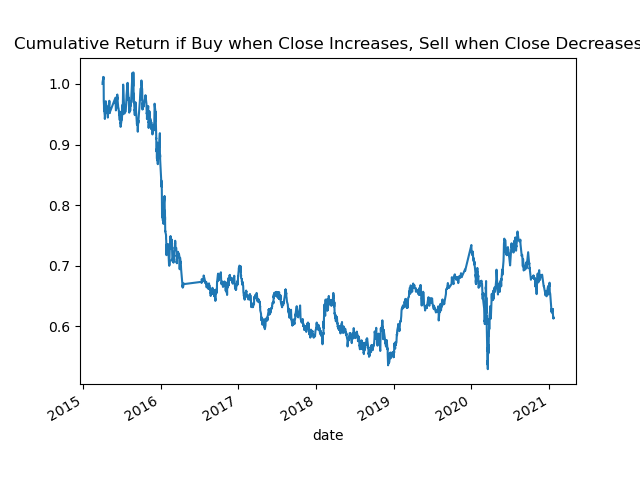
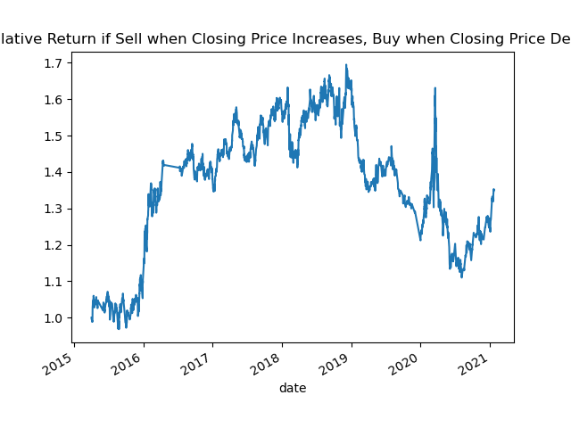
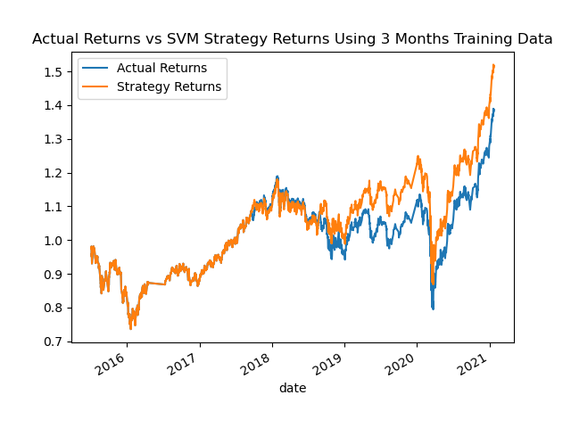
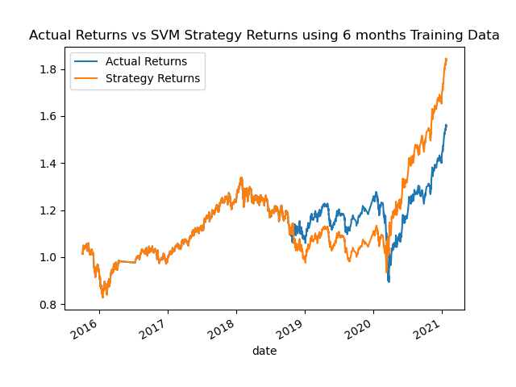
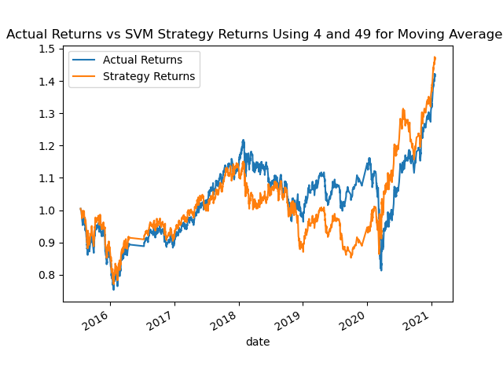
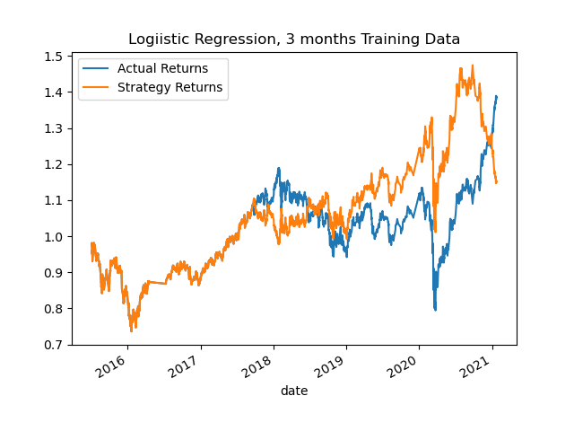

# Module_14_Challenge

# Initial Analysis

This strategy simply bought when the closing prices increased (ie: daily return was positive), sold when the closing price decreased (ie: daily return was negative), and held if there was no change to closing price.

Overall, the cumulative return has a negative trend.  This is not a good trend.

And I'd like to to point out that the strategy actually looks better if you do the exact opposite (sell when closing prices increase; buy when they decrease):

However that was not part of the assignment, was just for my own idle curiosity

# Support Vector Machine - Baseline

Now we start looking at SVM, using the the Fast (4 day) and Slow (100 day) moving averages.  This is our baseline strategy.  We break off the moving averages so that we're working with just date and moving averages, break the moving averages into two groups (training and testing) based on date, scale the moving averages, then feed the training data into the SVM model.  (Training was based on April 2, 2015 - July 2, 2015; Testing was July 6 2015 - January 21 2021.)  Once we've trained the model, we apply test testing data, to generate predictions for buy and sell indicators.

Comparing the two, the SVM model closely followed the actual returns.  However, looking at the classification report:

              precision    recall  f1-score   support

        -1.0       0.43      0.04      0.07      1804
         1.0       0.56      0.96      0.71      2288

    accuracy                           0.55      4092
   macro avg       0.49      0.50      0.39      4092
weighted avg       0.50      0.55      0.43      4092

the model overall did fairly poorly at predicting the buy and sell signals, and the low F1 scores do not provide a high confidence in the model.

# First Tuning - change months of training data

First tuning was to use the original data, but change the amount of training data from 3 months to 6 months.  This yields the following classification report:

              precision    recall  f1-score   support

        -1.0       0.44      0.02      0.04      1732
         1.0       0.56      0.98      0.71      2211

    accuracy                           0.56      3943
   macro avg       0.50      0.50      0.38      3943
weighted avg       0.51      0.56      0.42      3943

and graph:

Notice that at the end, using the 6 months training data the cumulative returns were close to 1.8, as opposed to 1.5 when using 3 months training data.  With the 6 months training data, the returns were actually lower in the 2019/2020 timeframe, although in 2021 it more than made up for the loss.

# Second Tuning - change months of training data
For this Tuning I used 4 days for short moving average and 49 days for long moving average.  I went back to the original 3 months training.  This yieled the following classification report:

              precision    recall  f1-score   support

        -1.0       0.43      0.16      0.23      1791
         1.0       0.56      0.83      0.67      2278

    accuracy                           0.54      4069
   macro avg       0.49      0.50      0.45      4069
weighted avg       0.50      0.54      0.48      4069

and graph:

Overall this was not a good strategy, performance went down, just barely outperforming actual returns in 2021.

# Logistic Regression

Logistic regression yielded the following classification report:

              precision    recall  f1-score   support

        -1.0       0.44      0.33      0.38      1804
         1.0       0.56      0.66      0.61      2288

    accuracy                           0.52      4092
   macro avg       0.50      0.50      0.49      4092
weighted avg       0.51      0.52      0.51      4092

and graph:

This was the worst strategy - it's the only one where the strategy cumulative returns ended below the actual cumulative returns.  Note too that it has lower accuracy, recall, and F1 scores than some of the other reports.

# Conclusion

The best result was given by changing the training data from 3 months to 6 months - this showed a cumulative return of over 1.8.  However in terms of the classification report, the second tuning, which shortened the long moving average from 100 to 49, provided better statistics, with a weighted average F1 score of .48, compared to .42 with the first tuning results.  Frankly I thought none of the models was particularly stellar, and I would continue to hunt for a better model.  My new model would definitely use at least 6 months of training data, though.